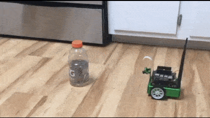
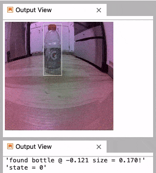
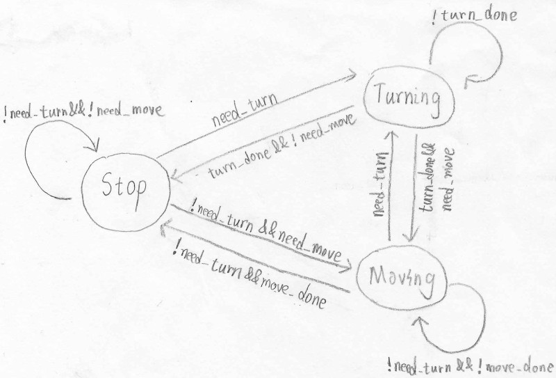

# Minion Bot

A simple object-following robot built with Machine Learning on NVIDIA Jetson Nano.

## Demo

**Bot camera**

## How it works

The robot does only one thing, which is to find the object and center it in its view. Here is how:

1. Grab a frame from the camera
1. Feed it to the vision model to find the bounding box of the object
1. Turn left or right if the object is not centered
1. Move back or forward if the object is too large or too small
1. Repeat

### Vision model

[YOLOv8](https://github.com/ultralytics/ultralytics) is the vision model at work. The model is pre-trained on the [COCO 2017 dataset](https://cocodataset.org). It can recognize 80 kinds of common objects. But seems bottles are what it can recognize the best. So I used one to guide the robot.

The model runs on the GPU. The performance isn't prime. With 320 x 180 resolution, it can run 6 frames per second with observable latency. This is at the bare minimal level to make the bot work. To optimize this, TensorRT is the smart way to go.

### Motion control

To avoid excessive movements, the robot maintains the angle and distance to the object similar to how the [Schmitt trigger](https://en.wikipedia.org/wiki/Schmitt_trigger) works. If the object moves outside a larger window, the robot moves to keep it in a smaller window. And it keeps stationary until the object moves outside the larger window again.

This logic is implemented as a state machine as follow. Note that turing is prioritized over moving in order to keep the object in sight.

### Hardware

The code runs on [NVIDIA Jetson Nano](https://developer.nvidia.com/embedded/jetson-nano-developer-kit), a powerful little ARM machine with an embedded 128-core GPU. The bot itself is the [JetBot kit](https://www.waveshare.com/product/ai/robots/mobile-robots/jetbot-ai-kit-acce.htm) from Waveshare.
